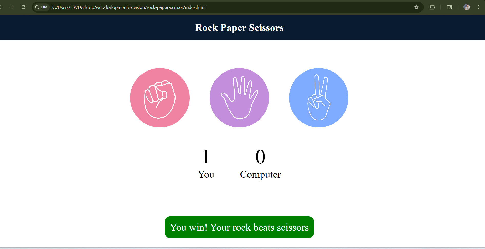

# 🎮 Rock Paper Scissors Game 

A simple and interactive **Rock Paper Scissors** game built using **HTML, CSS, and JavaScript**. This project allows users to play against the computer with real-time results and score tracking.

---

## 🚀 Features

* 🎯 User vs Computer gameplay
* 🔄 Random computer choice generation
* 📊 Live score tracking (User & Computer)
* ⚡ Instant result display (Win / Lose / Draw)
* 🎨 Clean and responsive UI

---

## 🛠️ Technologies Used

* HTML5
* CSS3
* JavaScript (Vanilla JS)

---

## 📂 Project Structure

```
rock-paper-scissor/
│── index.html
│── style.css
│── script.js
```

## 🎮 How to Play

1. Choose **Rock**, **Paper**, or **Scissors**
2. The computer will randomly select its move
3. The result will be displayed instantly
4. Scores will update automatically

---

## 📸 Screenshots


---

## 🔗 Live Demo

(Add your live project link here if deployed)

---

## 🙌 Author

* **Jitendra Dangi**

---

⭐ If you like this project, don’t forget to star the repository!
